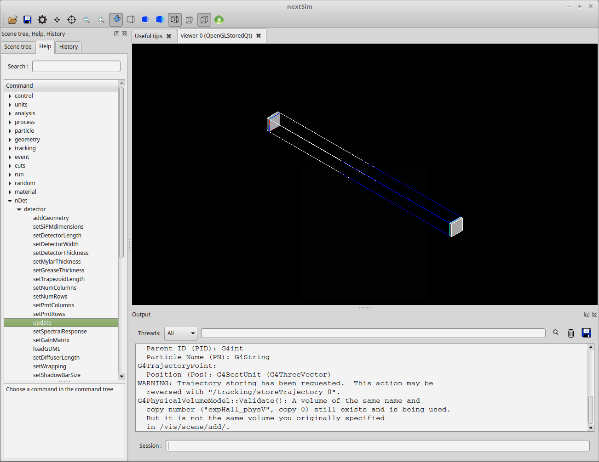
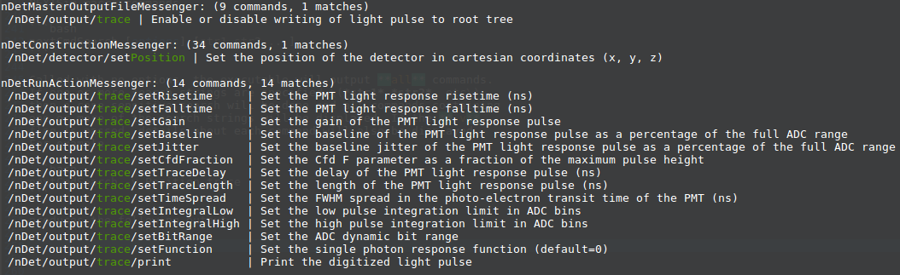

# NEXTSim README

[Cory R. Thornsberry](cthornsb@vols.utk.edu)

Last updated: May 24, 2019

## Authors

- Cory R Thornsberry
- David P&eacute;rez Loureiro 
- Kyle Schmitt
- Xiadong Zhang

## Installation

- Required Prerequisites:
	- [Geant4](https://geant4.web.cern.ch/support/download) version 10.3.3 or later is recommended
		- Build option `-DGEANT4_BUILD_MULTITHREADED=ON` is required for multithreading support
		- Build option `-DGEANT4_USE_GDML=ON` is required for GDML support
	- [ROOT](https://root.cern.ch/downloading-root) version 6 or later is recommended
	
- Optional Prerequisites:
	- [SimpleScan](https://github.com/cthornsb/SimplePixieScan) needed for nextSim output converter

```bash
git clone https://github.com/cthornsb/NEXTSim
cd NEXTSim
mkdir build
cd build
```

Common NEXTSim install options are shown in the table below

|OPTION                  | DEFAULT | DESCRIPTION |
|------------------------|---------|-------------|
|CMAKE\_INSTALL\_PREFIX  | install | Set the install prefix
|GEANT4\_MT              | OFF     | Enable or disable multithreading capability
|GEANT4\_GDML            | OFF     | Enable or disable support for loading GDML files
|GEANT4\_UIVIS           | ON      | Enable or disable Geant4 UI and VIS drivers
|BUILD\_TOOLS            | OFF     | Enable tool executables
|BUILD\_TOOLS\_NISTLIST  | OFF     | Build NIST database search executable
|BUILD\_TOOLS\_CONVERTER | OFF     | Build NEXTSim -> SimpleScan converter tool
|BUILD\_TOOLS\_CMDSEARCH | OFF     | Build NEXTSim macro command search executable

Install options may be set using ccmake e.g.

```bash
cmake ..
ccmake ..
```

or by passing options to CMake using the command line e.g.

```
cmake -DCMAKE_INSTALL_PREFIX=/path/to/install -DBUILD_TOOLS=ON ..
```

and so forth. Once CMake has successfully generated the makefile,
simply type


```bash
make install
```

to compile and install. Experimental/unstable beta versions of 
the simulation code may be found on the development branch

```bash
git checkout dev
cd build
make install
```

To switch back to the master release,

```bash
git checkout master
cd build
make install
```

### Installing the Module File

By default, cmake will install binaries to

NEXTSim/install/bin

From there you may make symbolic links as required, or if you
prefer you may use the NEXTSim module file

To installing the NEXTSim module file, the module file must
be copied to one of your module paths.

```bash
cp install/share/modulefiles/nextSim ${PATH_TO_MODULE_FILES}
```

Where PATH\_TO\_MODULE\_FILES is dependent upon the configuration
of your machine. You can check for the path by typing

```bash
module avail
```

For example, on my machine, the syntax would be

```bash
cp install/share/modulefiles/nextSim /usr/share/modules/modulefiles/
```

Whenever you want to use NEXTSim, load the NEXTSim module by typing

```bash
module load nextSim
```

## Updating the Source

In the ./NEXTSim/ directory type

```bash
git pull
cd build/
make install
```

Barring a substantial change in the structure of the source code,
this should be sufficient for keeping your install up-to-date with
the repository.

## Running a Simulation

Attempting to run nextSim with no arguments will result in an error

```bash
nextSim
```

[ERROR] nextSim: Input macro filename not specified!

Passing the `-h` flag will display a list of all command line options.
These options are summarized in the table below.

| Long Option       |Flag| Argument     | Description |
|-------------------|----|--------------|-------------|
| --help            | -h |              | Display the help dialogue and exit
| --input           | -i | <filename>   | Specify an input geant macro file
| --output          | -o | <prefix>     | Specify the prefix of the output file e.g. prefix-001.root
| --gui             | -g |              | Run interactive GUI session
| --tree            | -t | <treename>   | Set the output TTree name (default="data")
| --yield           | -Y | <multiplier> | Specify the light yield multiplier to use when producing photons (default=1)
| --verbose         | -V |              | Toggle verbose output mode
| --delay           | -D | <seconds>    | Set the time delay between successive event counter updates (default=10)
| --mt-thread-limit | -n | <threads>    | Set the number of threads to use (uses all threads for n <= 0)
| --mt-max-threads  | -T |              | Print the maximum number of threads and exit

The simplest way to start a session is to toggle the GUI flag i.e.

```bash
nextSim -g
```

This will bring up the default empty NEXTSim GUI session as seen below


Commands for source and detector setup may be selected from the command
window on the left. All NEXTSim commands are found under the **nDet**
drop-down menu.

For example

```bash
/nDet/detector/addGeometry rectangle
/nDet/detector/update
```

will generate the simplest possible detector, using default settings. The
detector should look something like



Note that, by default, the detector will be placed at the origin. This means
that particles will be generated at the center of the detector. To move the
detector use

```bash
/nDet/detector/setPosition 50 0 0 cm
/nDet/detector/addGeometry rectangle
/nDet/detector/update
```

This will place an additional detector at x=50, y=0, z=0 cm. Every time the
`addGeometry` command is called, a new detector is added to the scene with
whatever setup information was specified by the user prior to the call. To
get back to just one detector use the `clear` command

```bash
/nDet/detector/clear
/nDet/detector/setPosition 50 0 0 cm
/nDet/detector/addGeometry rectangle
/nDet/detector/update
```

Now the viewer should only show a single bar detector. Note that `update` must 
be called any time the setup is changed, otherwise the changes will not take effect.

To simulate an event, click the green play button on the top menu-bar. After a
short delay, while Geant is loading the high-precision neutron model, a green
track may be seen on the screen.


Note that by default the particle source will generate 1 MeV neutrons along
the X-axis. You may instead see an event where the neutron travels through
the detector without scattering. This means that you will not see the flash
of optical photons at the center of the detector, but if you see the green
neutron track everything is working as it should.

You may run as many single events as you wish, but eventually you will want
to simulate a batch of events all at once. To do this, type

```bash
/run/beamOn 100
```

The `beamOn` command will generate the specified number of events. Once you
close the GUI window, you will notice that a root file has been generated.
By default, it will have the time and date as its filename.

The GUI is good for testing new detector setups on an event-by-event basis
but the constant drawing of particle tracks will slow the program considerably.
Instead of running an interactive session, we may copy the above commands into
an ascii file.

Now insead of starting with the `-g` flag, we start with `-i` indicating
that we want the program to read from an input macro e.g.

```bash
nextSim -i ourFirstMacro.mac
```

Note that any interactive commands may also be used in a macro file. This
makes it much easier to simulate more complicated setups. Instead of a GUI
window, all output is piped through stdout. But the simulation running
behind the scenes is exactly the same as with the GUI session.

Many different types of setups may be simulated. There are currently over 60
macro commands which may be used to generate various detector geometries
with different PMT output characteristics. Several example macro files 
are included in the directory NEXTSim/mac/ which show how to use some
of these commands.

## Searching for Macro Commands

If you installed with the `-DBUILD_TOOLS_CMDSEARCH=ON` option, you may
use the command search executable to print all the currently defined
NEXTSim macro commands.

```bash
nextCmdSearch [options] [str1 str2 ...]
```

Called with no options, the executable will output **all** commands.
If one or more search strings are specified \(*str1* *str2*, etc\)
then a case-sensitive search will be done and all commands containing
one or more of the search strings will be displayed. If the `-v`
flag is passed, details about each command will also be displayed.
For example

```bash
nextCmdSearch -v Position trace
```

produces the following output




