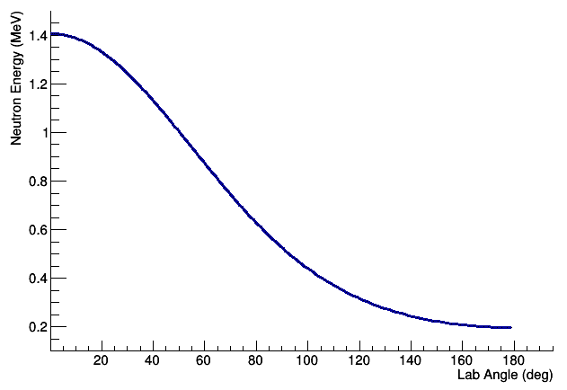

# NEXTSim Reaction Files

[Cory R. Thornsberry](cthornsb@vols.utk.edu)

Last updated: May 24, 2019

## Using a Reaction Source

Instead of using a particle beam or a source with a discrete energy spectrum,
it is possible to use a 2-body kinematics reaction instead. To do this, use
the macro command

```
/nDet/source/reaction pt.rxn
```

where pt.rxn is the filename of a tab-delimited ascii file, an example of which
is shown below

|-------------|------------|---------------|---------------------|
| Beam Z      | Beam A     | Beam BE/A     |                     |
| Target Z    | Target A   | Target BE/A   |                     |
| Recoil Z    | Recoil A   | Recoil BE/A   | Recoil Excitation   |
| Ejectile Z  | Ejectile A | Ejectile BE/A | Ejectile Excitation |
| Beam Energy |            |               |                     |

Where Z and A are integer numbers and the binding energy, excitation energy, and
beam energy are specified in MeV. As an example, a reaction file for a p-t reaction
with 2.2 MeV protons is given below.

```
1	1	0
1	3	2.827265
2	3	2.57268	0
0	1	0	0
2.2
```

By default, the beam is defined along the X-axis but the source may be rotated
to any angle in 3d space using `/nDet/source/direction`. The energy of the outgoing 
particle varies as a function of the angle with respect to the beam axis but does 
not vary with azimuthal angle. The neutron energy distribution for such a source 
is shown below.


