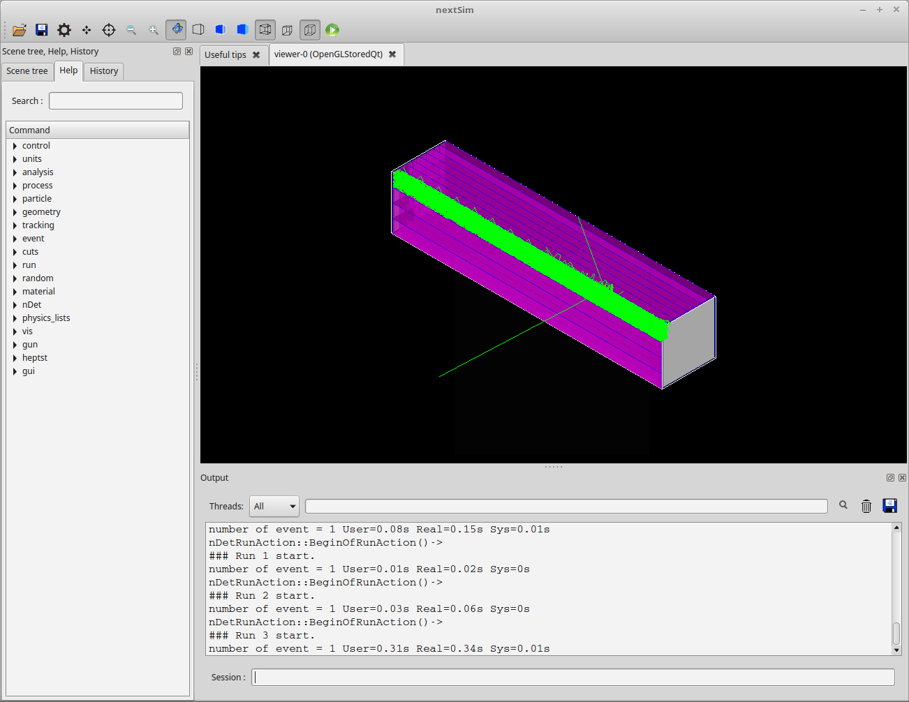

# NEXTSim Segmented Scintillator Detectors

[Cory R. Thornsberry](cthornsb@vols.utk.edu)

Last updated: May 24, 2019

## Using a Segmented Detector

By default, even if you use `/nDet/detector/addGeometry module`, the number
of scintillator columns and rows is equal to one. 

```
/nDet/detector/setNumColumns 8
/nDet/detector/setNumRows 4
```

These two commands will set the number of columns (along the X-axis or width 
of the detector) and the number of rows (along the Y-axis or thickness of the
detector) of scintillator cells that the modular detector has. So now using

```
/nDet/detector/addGeometry module
```

will add a segmented NEXT detector to the setup. The image below shows a
segmented NEXT module with 8x4 scintillator cells. The neutron track hits
the detector from the right and produces scintillation light in one of the
scintillator cells.


